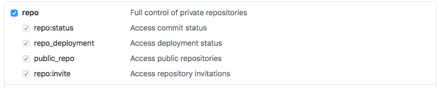

## Automatically committing a change to detect and suppress failing tests

Let’s create the lane. In your project directory, you should have a `Fastfile` inside of a `fastlane` directorty. Open that up and create the new lane:

```ruby
lane :sweep do |options|
  multi_scan(
    project: 'absolute_path/to/Your.xcodeproj',
    try_count: 3,
    fail_build: false
  )
end
```

`multi_scan` is an action in the `fastlane` `test_control` plugin that will automatically re-run only failing tests a given number of times specified by `:try_count`. 
Let’s add that plugin to our `fastlane` configuration by typing `fastlane add_plugin test_center` in the Terminal within your project directory.
Next, let’s collect the failing tests and then suppress them. We can use the return value of `multi_scan` to determine which tests failed, and the `suppress_tests` action to add them to the list of tests to be skipped:

```ruby
lane :sweep do |options|
  result = multi_scan(
    project: XCODE_PROJECT_FILEPATH,
    try_count: 3,
    fail_build: false,
    scheme: SCHEME,
    output_directory: 'test_results',
    output_types: 'junit',
    output_files: 'report.junit'
  )
  failed_tests = result[:failed_tests]
  unless failed_tests.size.zero?
    suppress_tests(
      xcodeproj: XCODE_PROJECT_FILEPATH,
      tests: failed_tests,
      scheme: SCHEME
    )
  end
end
```

Now that we are automatically suppressing the failed tests, we need to commit the change to the Xcode Scheme with Git. Update your `:sweep` lane to create a new branch and then call fastlane's  `git_commit` action:
```ruby
lane :sweep do |options|
  result = multi_scan(
    project: XCODE_PROJECT_FILEPATH,
    try_count: 3,
    fail_build: false,
    scheme: SCHEME,
    output_directory: 'test_results',
    output_types: 'junit',
    output_files: 'report.junit'
  )
  failed_tests = result[:failed_tests]
  unless failed_tests.size.zero?
    git_checkout_newbranch = [
      'git',
      'checkout',
      '-b',
      "suppress_tests_#{Time.now.getutc.to_s.gsub(/[^0-9a-zA-Z]/, '_')}"
    ]
    Actions.sh(git_checkout_newbranch.join(' '))
    suppress_tests(
      xcodeproj: XCODE_PROJECT_FILEPATH,
      tests: failed_tests,
      scheme: SCHEME
    )
    git_commit(
      path: "#{XCODE_PROJECT_FILEPATH}/**/*.xcscheme",
      message: 'Silence failing tests'
    )
  end
end
```
Now that we have the change, we need to push the change to our remote Github repo. For that, we need to get a Github token to grant our program the rights to push, so create the token here. 

Provide a meaningful description for your Github token, such as “test suppression agent” for the Token description field:


Select the repo scope.



Copy the token as instructed and then, in your Terminal, type: `echo`, paste the token you copied, and continue typing:  ` > ~/.github-token` and press enter to create the file.

Now that we’ve created the `~/.github-token` file, we can now update our `:sweep` lane to create the Github pull request using fastlane's `create_pull_request` action to make a pull request with the modified Xcode Scheme.

```ruby
lane :sweep do |options|
  result = multi_scan(
    project: XCODE_PROJECT_FILEPATH,
    try_count: 3,
    fail_build: false,
    scheme: SCHEME,
    output_directory: 'test_results',
    output_types: 'junit',
    output_files: 'report.junit'
  )
  failed_tests = result[:failed_tests]
  unless failed_tests.size.zero?
    git_checkout_newbranch = [
      'git',
      'checkout',
      '-b',
      "suppress_tests_#{Time.now.getutc.to_s.gsub(/[^0-9a-zA-Z]/, '_')}"
    ]
    Actions.sh(git_checkout_newbranch.join(' '))
    suppress_tests(
      xcodeproj: XCODE_PROJECT_FILEPATH,
      tests: failed_tests,
      scheme: SCHEME
    )
    git_commit(
      path: "#{XCODE_PROJECT_FILEPATH}/**/*.xcscheme",
      message: 'Silence failing tests'
    )
    push_to_git_remote
    repo = 'your-username/your-repo'
    pr_title = 'Silencing fragile tests'
    pr_body = "Silencing the following failing tests:\r\n```\r\n"
    failed_tests.each { |failed_test| pr_body << "#{failed_test}\r\n" }
    pr_body << "```\r\n@your-username please review and merge!"
    create_pull_request(
      api_token: File.read(File.expand_path('~/.github-token')).strip,
      repo: repo,
      title: pr_title,
      body: pr_body
    )
  end
end
```
The notification will tag you so that you can review the change before merging it to your code.

The only thing that remains is to test it locally and then test it on your CI system.

To test it locally, type the following in your Terminal at your project directory:
```
fastlane sweep
```

That should perform all the steps without error.

To test it on your CI, you need to copy the Github token to all of your CI build machines, or you need to configure your CI jobs to send the key via a secured field in the job. 

**Do not commit your Github token to your repo, as that is very insecure and can be easily found and used to perform nasty things to your repo.**

I will leave the work involved in copying the token to a CI job to the reader. Keep in mind that if you have to send the token as a Environment variable in your CI job, you won’t be able to read it from the file system and will have to name it `GITHUB_TOKEN` (make sure you remove the `api_token` parameter from the call to `create_pull_request`).

Now, start the CI job, and you should see your Github pull request created if you have failing tests (fake it if necessary).
With this fastlane lane, you now have a code that will automatically run the tests, suppress only the truly failing tests, and create a Github pull request.

## Automatically creating or updating an Issue for failing tests

### Github Issues

Github provides its own [Issue tracker](https://guides.github.com/features/issues/) which we can use to track the progress on fixing the tests that we suppressed. If you’re already using Github, this is the easiest to setup and start using right from your Fastfile:

```ruby
lane :sweep do |options|
  result = multi_scan(
    project: XCODE_PROJECT_FILEPATH,
    try_count: 3,
    fail_build: false,
    scheme: SCHEME,
    output_directory: 'test_results',
    output_types: 'junit',
    output_files: 'report.junit'
  )
  failed_tests = result[:failed_tests]
  unless failed_tests.size.zero?
    git_checkout_newbranch = [
      'git',
      'checkout',
      '-b',
      "suppress_tests_#{Time.now.getutc.to_s.gsub(/[^0-9a-zA-Z]/, '_')}"
    ]
    Actions.sh(git_checkout_newbranch.join(' '))
    suppress_tests(
      xcodeproj: XCODE_PROJECT_FILEPATH,
      tests: failed_tests,
      scheme: SCHEME
    )
    git_commit(
      path: "#{XCODE_PROJECT_FILEPATH}/**/*.xcscheme",
      message: 'Silence failing tests'
    )
    push_to_git_remote
    repo = 'your-username/your-repo'
    pr_title = 'Silencing fragile tests'
    pr_body = "Silencing the following failing tests:\r\n```\r\n"
    failed_tests.each { |failed_test| pr_body << "#{failed_test}\r\n" }
    pr_body << "```\r\n@lyndsey-ferguson please review and merge!"
    create_pull_request(
      api_token: File.read(File.expand_path('~/.github-token')).strip,
      repo: repo,
      title: pr_title,
      body: pr_body
    )
  end
end
```

Since we will add more code to this lane, let’s refactor it so that the suppression of failed tests is in a function of its own; that way the code become easier to read and comprehend.

Pull out the code inside of the unless `failed_tests.size.zero?` block and place it inside a function named `suppress_failed_tests` that accepts the failed_tests as a parameter.

```ruby
lane :sweep do |options|
  result = multi_scan(
    project: XCODE_PROJECT_FILEPATH,
    try_count: 3,
    fail_build: false,
    scheme: SCHEME,
    output_directory: 'test_results',
    output_types: 'junit',
    output_files: 'report.junit'
  )
  failed_tests = result[:failed_tests]
  unless failed_tests.size.zero?
    suppress_failed_tests(failed_tests)
  end
end
def suppress_failed_tests(failed_tests)
  git_checkout_newbranch = [
    'git',
    'checkout',
    '-b',
    "suppress_tests_#{Time.now.getutc.to_s.gsub(/[^0-9a-zA-Z]/, '_')}"
  ]
  Actions.sh(git_checkout_newbranch.join(' '))
  suppress_tests(
    xcodeproj: XCODE_PROJECT_FILEPATH,
    tests: failed_tests,
    scheme: SCHEME
  )
  git_commit(
    path: "#{XCODE_PROJECT_FILEPATH}/**/*.xcscheme",
    message: 'Silence failing tests'
  )
  push_to_git_remote
  repo = 'your-username/your-repo'
  pr_title = 'Silencing fragile tests'
  pr_body = "Silencing the following failing tests:\r\n```\r\n"
  failed_tests.each { |failed_test| pr_body << "#{failed_test}\r\n" }
  pr_body << "```\r\n@lyndsey-ferguson please review and merge!"
  create_pull_request(
    api_token: File.read(File.expand_path('~/.github-token')).strip,
    repo: repo,
    title: pr_title,
    body: pr_body
  )
end
```

I like to create an Issue for each failing test just in case the root cause for the failure is different for each test. Of course, if the testing infrastructure is at the root of many failing tests, it would be better to create one Issue for all the tests (but we won’t do that in this Walkthrough).

`multi_scan's` return value is a `Hash` which has the failing tests and information about each failure in the :failure_details value. We’ll need that in order to create informative Issues, so let’s refactor our code to start using that by modifying our `:sweep` lane:

```ruby
lane :sweep do |options|
  result = multi_scan(
    project: XCODE_PROJECT_FILEPATH,
    try_count: 3,
    fail_build: false,
    scheme: SCHEME,
    output_directory: 'test_results',
    output_types: 'junit',
    output_files: 'report.junit'
  )
  failure_details = result[:failure_details] || {}
  unless failure_details.empty?
    suppress_failed_tests(failure_details.keys)
  end
end
Now, let’s simply print out the test failure details to the Console to get an idea of what’s going on:
lane :sweep do |options|
  result = multi_scan(
    project: XCODE_PROJECT_FILEPATH,
    try_count: 3,
    fail_build: false,
    scheme: SCHEME,
    output_directory: 'test_results',
    output_types: 'junit',
    output_files: 'report.junit'
  )
  failure_details = result[:failure_details] || {}
  unless failure_details.empty?
    suppress_failed_tests(failure_details.keys)
    
    failure_details.each do |failed_test, details|
       UI.message("#{failed_test}` is failing on #{details[:location]} due to: #{details[:message]}")
    end
end
Let’s now start creating an Issue for a failed test by writing the method that will post a new Issue to Github using the GitHub Issues API guide. The Create an Issue section indicates that we can send the Issue title and body in a POST call. Lucky for us, fastlane includes the github_api that we can use.
def create_issue_github(options)
  # create a payload to pass to the github_api method
  payload = {
    'title' => options[:title],
    'body' => options[:body]
  }
  post_new_issue_result = github_api(
    http_method: 'POST',
    path: "repos/#{GITHUB_REPO}/issues",
    body: payload,
    error_handlers: {
      '*' => proc do |post_new_issue_result|
        UI.error("GitHub responded with #{post_new_issue_result[:status]}: #{post_new_issue_result[:body]}")
        return nil
      end
    }
  )
  
  json = post_new_issue_result[:json]
  number = json['number']
  html_url = json['html_url']
  UI.success("Successfully created issue request ##{number}. You can see it at '#{html_url}'")
end
```

Now that we have a method that creates the Issue, let’s hook it into our `:sweep` lane:

```ruby
lane :sweep do |options|
  result = multi_scan(
    project: XCODE_PROJECT_FILEPATH,
    try_count: 3,
    fail_build: false,
    scheme: SCHEME,
    output_directory: 'test_results',
    output_types: 'junit',
    output_files: 'report.junit'
  )
  failure_details = result[:failure_details] || {}
  unless failure_details.empty?
    suppress_failed_tests(failure_details.keys)
    
    failure_details.each do |failed_test, details|
       create_issue_github(
         title: "Fix failing test #{failed_test}",
         body: "`#{failed_test}` is failing on #{details[:location]} due to:\r\n" \
               "```\r\n" \
               "#{details[:message]}\r\n" \
               "```\r\n"
       )
    end
end
```

Try this out, you should now be creating issues for each failed test.

There is a problem though: if we have not yet closed an Issue for a failing test, we will just keep creating Issues. It would be preferable if we would add a comment to the existing issue rather than creating more and more tickets that will end up being ignored.

Let’s add code to get the list of open issues. If one of the open issues has the same title as the ticket we want to create, let’s add a comment, otherwise, let’s go ahead and create the new issue.

```ruby
def create_issue_github(options)
  payload = {
    'state' => 'open'
  }
  get_issues_result = github_api(
    http_method: 'GET',
    path: "repos/#{GITHUB_REPO}/issues",
    body: payload
  )
  found_issue_number = nil
  issue_exists = get_issues_result[:json].any? do |found_issue_result|
    # both pull requests and issues are a type of issue. Let's just
    # get issues that do not have the 'pull_request' attribute.
    is_issue = found_issue_result['pull_request'].nil?
    if is_issue && found_issue_result['title'] == options[:title]
      found_issue_number = found_issue_result['number']
    end
    false == found_issue_number.nil?
  end
  if found_issue_number
    payload = {
      'body' => '@lyndsey-ferguson this test is still failing!'
    }
    add_issue_comment_result = github_api(
      http_method: 'POST',
      path: "repos/#{GITHUB_REPO}/issues/#{found_issue_number}/comments",
      body: payload
    )
    return
  end
  # create a payload to pass to the github_api method
  payload = {
    'title' => options[:title],
    'body' => options[:body]
  }
post_new_issue_result = github_api(
    http_method: 'POST',
    path: "repos/#{GITHUB_REPO}/issues",
    body: payload,
    error_handlers: {
      '*' => proc do |post_new_issue_result|
        UI.error("GitHub responded with #{post_new_issue_result[:status]}: #{post_new_issue_result[:body]}")
        return nil
      end
    }
  )
  
  json = post_new_issue_result[:json]
  number = json['number']
  html_url = json['html_url']
  UI.success("Successfully created issue request ##{number}. You can see it at '#{html_url}'")
end
```

You know what, after looking at this, it would make sense to rename this function and break it up into parts: one part to find the issue, one part to update the issue and the final part to create the issue if it doesn’t exist. 

Let’s go ahead and do that. First, let’s pull out the code to determine if the issue is open into a function that returns a Boolean for the open state and an Issue number:

```ruby
def is_issue_open(issue_title)
  payload = {
    'state' => 'open'
  }
  get_issues_result = github_api(
    http_method: 'GET',
    path: "repos/#{GITHUB_REPO}/issues",
    body: payload,
    error_handlers: {
      '*' => proc do |get_open_issues_result|
        UI.error("GitHub responded with #{get_open_issues_result[:status]}: #{get_open_issues_result[:body]}")
        return [false, 0]
      end
    }
  )
  
  found_issue_number = nil
  get_issues_result[:json].any? do |found_issue_result|
    # both pull requests and issues are a type of issue. Let's just
    # get issues that do not have the 'pull_request' attribute.
    is_issue = found_issue_result['pull_request'].nil?
    if is_issue && found_issue_result['title'] == issue_title
      found_issue_number = found_issue_result['number']
    end
  end
  found_issue_number
end
```

And update the create_issue_github method to use this new method:

```ruby
def create_issue_github(options)
  found_issue_number = is_issue_open(options[:title])
  if found_issue_number
    payload = {
      'body' => '@lyndsey-ferguson this test is still failing!'
    }
    add_issue_comment_result = github_api(
      http_method: 'POST',
      path: "repos/#{GITHUB_REPO}/issues/#{found_issue_number}/comments",
      body: payload
    )
    return
  end
  payload = {
    'title' => options[:title],
    'body' => options[:body]
  }
  post_new_issue_result = github_api(
    http_method: 'POST',
    path: "repos/#{GITHUB_REPO}/issues",
    body: payload,
    error_handlers: {
      '*' => proc do |post_new_issue_result|
        UI.error("GitHub responded with #{post_new_issue_result[:status]}: #{post_new_issue_result[:body]}")
        return nil
      end
    }
  )
  json = post_new_issue_result[:json]
  number = json['number']
  html_url = json['html_url']
  UI.success("Successfully created issue request ##{number}. You can see it at '#{html_url}'")
end
```

Before we continue refactoring, go ahead and run this with `bundle exec fastlane sweep` to ensure that your code is still creating or updating Issues.

The next step is to pull out the code that updates the Issue into its own function:

```ruby
def add_issue_comment(issue_number, comment)
  payload = {
   'body' => comment
  }
  add_issue_comment_result = github_api(
    http_method: 'POST',
    path: "repos/#{GITHUB_REPO}/issues/#{issue_number}/comments",
    body: payload,
    error_handlers: {
      '*' => proc do |post_issue_comment_result|
        UI.error("GitHub responded with #{post_issue_comment_result[:status]}: #{post_issue_comment_result[:body]}")
        return nil
      end
    }
  )[:json]
  html_url = add_issue_comment_result['html_url']
  UI.success("Successfully updated issue ##{issue_number}. You can see it at '#{html_url}'")
end
```
And the code that creates the Issue into its own function:
```ruby
def create_issue(title, body)
  payload = {
    'title' => title,
    'body' => body
  }
  create_issue_result = github_api(
    http_method: 'POST',
    path: "repos/#{GITHUB_REPO}/issues",
    body: payload,
    error_handlers: {
      '*' => proc do |post_new_issue_result|
        UI.error("GitHub responded with #{post_new_issue_result[:status]}: #{post_new_issue_result[:body]}")
        return nil
      end
    }
  )[:json]
  number = create_issue_result['number']
  html_url = create_issue_result['html_url']
  UI.success("Successfully created issue request ##{number}. You can see it at '#{html_url}'")
end
```
And now we have to rename our method, create_issue_github and update it to use our new methods:
```ruby
def update_issue(options)
  found_issue_number = is_issue_open(options[:title])
  if found_issue_number
    add_issue_comment(found_issue_number, '@lyndsey-ferguson this test is still failing!')
  else
    create_issue(options[:title], options[:body])
  end
end
```
And then, we have to update our lane to use the new method:
```ruby
lane :sweep do |_options|
  result = multi_scan(
    project: XCODE_PROJECT_FILEPATH,
    try_count: 3,
    fail_build: false,
    scheme: 'AtomicBoy',
    output_directory: 'test_results',
    output_types: 'junit',
    output_files: 'report.junit'
  )
  failure_details = result[:failure_details] || {}
  unless failure_details.empty?
    suppress_failed_tests(failure_details.keys)
    failure_details.each do |failed_test, details|
      update_issue(
        title: "Fix failing test #{failed_test}",
        body: "`#{failed_test}` is failing on #{details[:location]} due to:\r\n" \
        "```\r\n" \
        "#{details[:message]}\r\n" \
        "```\r\n"
      )
    end
  end
end
```
Now that we have updated the lane, let’s run it locally: `bundle exec fastlane sweep`. If everything works smoothly, you should get a new pull request and either a new Issue or an Issue with a comment that the test(s) are still failing.

If you’ve set up your CI to run this, you just need to add your changes to Git and merge it in.