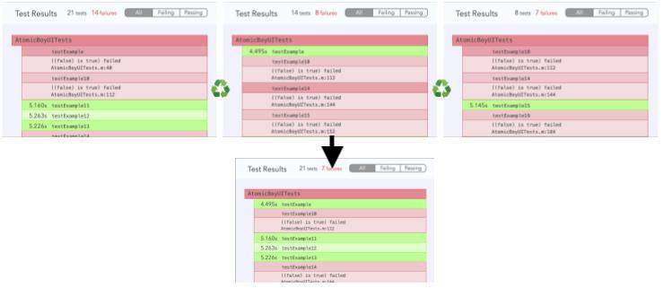

# 🔶 collate_html_reports

Do you have multiple html test reports coming in from different sources and need them combined? Use this action to collate all the tests performed for a given test target into one report file.



## Example

<!-- collate_html_reports examples: begin -->

```ruby

UI.important(
  'example: ' \
  'collate the html reports to a temporary file "result.html"'
)
reports = Dir['../spec/fixtures/*.html'].map { |relpath| File.absolute_path(relpath) }
collate_html_reports(
  reports: reports,
  collated_report: File.join(Dir.mktmpdir, 'result.html')
)

```
<!-- collate_html_reports examples: end -->

## Parameters

<!-- collate_html_reports parameters: begin -->
|Parameter|Description|Default Value|
|:-|:-|-:|
|reports|An array of HTML reports to collate. The first report is used as the base into which other reports are merged in||
|collated_report|The final HTML report file where all testcases will be merged into|result.html|
<!-- collate_html_reports parameters: end -->


