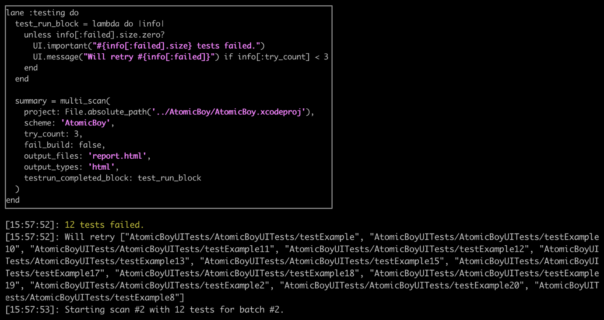

# ♻️  multi_scan 🎉

Use `:multi_scan` intead of `:scan` to [improve the usefulness](#improving-usefulness) of iOS test results, [reduce test run time](#reduce-test-run-time), [inspect partial results](#inspect-partial-results) periodically during a test run, and provide better [results reporting](#better-results-reporting).

> **Note** regarding invocation based tests
>
> If your tests are invocation based like [Kiwi](https://github.com/kiwi-bdd/Kiwi) you need to set `:invocation_based_tests` to handle these tests, because unlike `XCTest`s the list of tests cannot be deterimned before running and also you can't try an exact test (The reruns run the whole file where the test failed).

## Improving Usefulness

Over time, your tests can change the state of your application in unexpected ways that cause other tests to fail randomly. Or, the tools and infrastructure for testing are the root causes of random test failures. The test results may not truly reflect how the product code is working.

Rather than wasting time trying to account for unstable tools, or trying to tweak your test code ad-nauseum to get a passing result reliably, just use the `:try_count` option to run `:scan` multiple times, running only the tests that failed each time. This ensures that any _fragility_ is ironed out over a number of "tries". The end result is that only the truly failing tests appear.

Another issue that can cause tests to incorrectly fail comes from an issue with the iOS Simulator. If you provide a huge number of tests to the iOS Simulator, it can exhaust the available resources and cause it to fail large numbers of tests. You can get around this by running your tests in batches using the `:batch_count` option in order to lighten the load on the simulator.

## Reduce Test Run Time

Make better use of your Mac resources by running batches of test runs in parallel iOS Simulators running simultaneously. Use the `:parallel_testrun_count` option to specify 2 to 6 simulators, each running a subset of your tests. It is not recommended to run more than 6 simulators in parallel as the service that backs the simulators can fail to connect to them.

> Note: while Xcode provides the option to run testsuites in parallel, this does not help if one testsuite has 100 testcases and another has 300 testcases. 
> That's because each of those testsuites will run on their own iOS Simulator and you have to wait for the Simulator with the most testcases: 300 testcases in this example.
>
> `multi_scan`, on the other hand, can split those tests into 4 batches of 100 using a `:parallel_testrun_count` of 4. You only have to wait for each of the iOS Simulators to finish 100 testcases.

<center></center>


## Inspect Partial Results

If you have a large number of tests, and you want to inspect the overall status of how test runs are progressing, you can use the `:testrun_completed_block` callback to bailout early or make adjustments on how your tests are exercised.

<center></center>

## Better Results Reporting

Do you have multiple test targets and the normal operation of `:scan` is providing you a junit report that implies that all the tests ran in just one test target? Don't worry, `:multi_scan` has fixed that in v3.14.0 by adding a `package` attribute to each testsuite to let you which test target the test was run in. `:multi_scan` can handle JUnit, HTML, JSON, and Apple's `xcresult` bundles.

> **Note**: I'm making the collation of junits with multiple targets available to Supporters first to show them appreciation. I'll open it up to everyone else on September 15th, 2020.
>
> Interested in joining? Click [here ♥️](https://github.com/sponsors/lyndsey-ferguson) and select a tier that gives you early access to new features.
>
> **Bonus**: if your organization (👨‍👩‍👧‍) becomes a Sponsor, every member of that org gets that same early access!


`xcresult` bundles are particularly useful because they contain screenshots of the UI when a UI test fails so you can review what was actually there compared to what you expected.

> **Notes about `xcresult` and `result_bundle`**:
> 1. `multi_scan` adds support for `xcresult` as an additional `:output_type`. This allows you to name your `xcresult` files using the `:output_files` parameter (`scan` does not support this).
>
> 2. If you pass `xcresult` as a type, `multi_scan` will _not_ pass the `result_bundle` parameter down to `scan` to ensure that your chosen name in `output_files` is used.
>
> 3. The `result_bundle` option used to provide `.result_bundle` files. `scan` recently changed that file extension to `.xcresult` to match what Apple is naming the file, and this broke builds expecting the `.result_bundle` extension. As a fix, `multi_scan` creates a `.result_bundle` symbolic link to the `.xcresult` bundle.

****


## Examples

<!-- multi_scan examples: begin -->

```ruby

UI.important(
  'example: ' \
  'split the tests into 4 batches and run each batch of tests in ' \
  'parallel up to 3 times if tests fail. Abort the testing early ' \
  'if there are too many failing tests by passing in a ' \
  ':testrun_completed_block that is called by :multi_scan ' \
  'after each run of tests.'
)
test_run_block = lambda do |testrun_info|
  failed_test_count = testrun_info[:failed].size
  passed_test_count = testrun_info[:passing].size
  try_attempt = testrun_info[:try_count]
  batch = testrun_info[:batch]

  # UI.abort_with_message!('You could conditionally abort')
  UI.message("\ὠA everything is fine, let's continue try #{try_attempt + 1} for batch #{batch}")
end

multi_scan(
  project: File.absolute_path('../AtomicBoy/AtomicBoy.xcodeproj'),
  scheme: 'AtomicBoy',
  try_count: 3,
  batch_count: 4,
  fail_build: false,
  parallel_testrun_count: 4,
  testrun_completed_block: test_run_block
)

```

```ruby

UI.important(
  'example: ' \
  'multi_scan also works with json.'
)
multi_scan(
  workspace: File.absolute_path('../AtomicBoy/AtomicBoy.xcworkspace'),
  scheme: 'AtomicBoy',
  try_count: 3,
  output_types: 'json',
  output_files: 'report.json',
  fail_build: false
)

```
<!-- multi_scan examples: end -->

## Parameters

In addition to the parameters supported by [`scan`](https://docs.fastlane.tools/actions/scan/#parameters), these parameters are supported:
<!-- multi_scan parameters: begin -->
|Parameter|Description|Default Value|
|:-|:-|-:|
|try_count|The number of times to retry running tests via scan|1|
|batch_count|The number of test batches to run through scan. Can be combined with :try_count|1|
|retry_test_runner_failures|Set to true If you want to treat build failures during testing, like 'Test runner exited before starting test execution', as 'all tests failed'|false|
|invocation_based_tests|Set to true If your test suit have invocation based tests like Kiwi|false|
|swift_test_prefix|The prefix used to find test methods. In standard XCTests, this is `test`. If you are using Quick with Swift, set this to `spec`|test|
|quit_simulators|If the simulators need to be killed before running the tests|true|
|collate_reports|Whether or not to collate the reports generated by multiple retries, batches, and parallel test runs|true|
|parallel_testrun_count|Run simulators each batch of tests and/or each test target in parallel on its own Simulator|1|
|pre_delete_cloned_simulators|Delete left over cloned simulators before running a parallel testrun|true|
|testrun_completed_block|A block invoked each time a test run completes. When combined with :parallel_testrun_count, will be called separately in each child process||
<!-- multi_scan parameters: end -->
