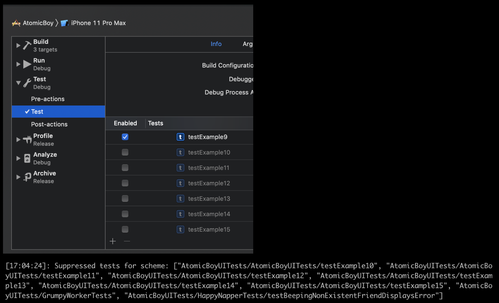

# 🗜 suppressed_tests

Do you have an automated process that requires the list of suppressed tests in your Xcode project or Scheme? Use this action to get that list.

<center></center>

## Examples

<!-- suppressed_tests examples: begin -->

```ruby

UI.important(
  'example: ' \
  'get the tests that are suppressed in a Scheme in the Project'
)
tests = suppressed_tests(
  xcodeproj: 'AtomicBoy/AtomicBoy.xcodeproj',
  scheme: 'AtomicBoy'
)
UI.message("Suppressed tests for scheme: #{tests}")

```

```ruby

UI.important(
  'example: ' \
  'get the tests that are suppressed in all Schemes in the Project'
)
UI.message(
  "Suppressed tests for project: #{suppressed_tests(xcodeproj: 'AtomicBoy/AtomicBoy.xcodeproj')}"
)

```

```ruby

UI.important(
  'example: ' \
  'get the tests that are suppressed in all Schemes in a workspace'
)
tests = suppressed_tests(
  workspace: File.absolute_path('../AtomicBoy/AtomicBoy.xcworkspace'),
  scheme: 'Professor'
)
UI.message("tests: #{tests}")

```
<!-- suppressed_tests examples: end -->

# Parameters

<!-- suppressed_tests parameters: begin -->
|Parameter|Description|Default Value|
|:-|:-|-:|
|xcodeproj|The file path to the Xcode project file to read the skipped tests from||
|workspace|The file path to the Xcode workspace file to read the skipped tests from||
|scheme|The Xcode scheme where the suppressed tests may be||
<!-- suppressed_tests parameters: end -->
