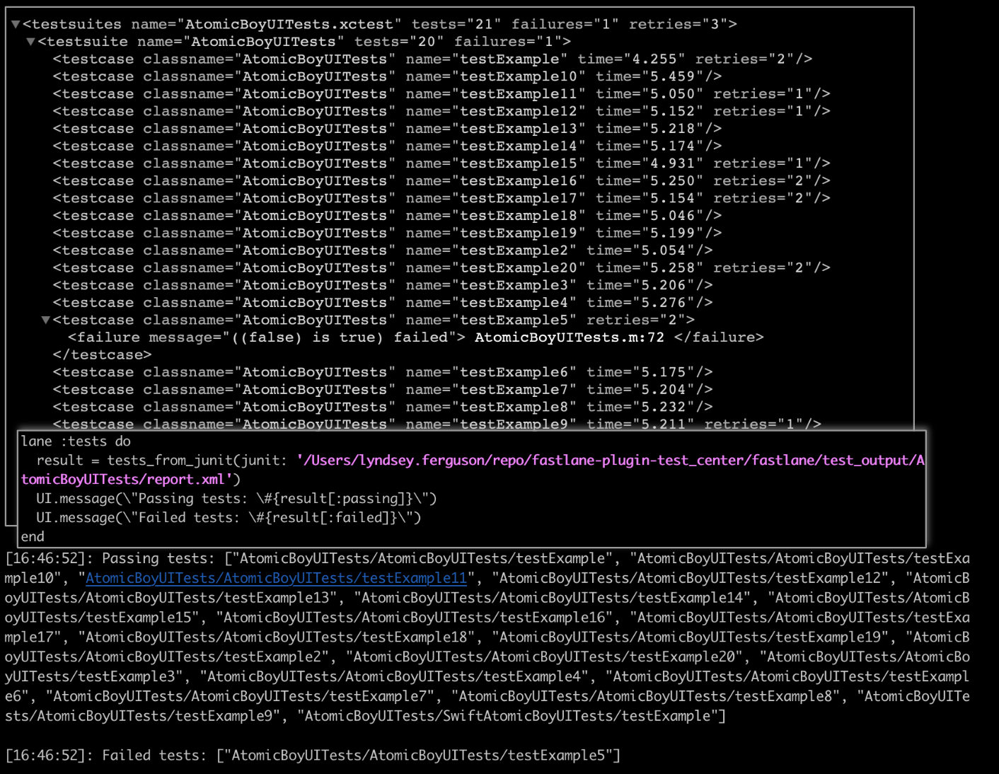

# ☑️  tests_from_junit

Performing analysis on a test report file? Get the failing and passing tests using this action.

<center></center>

## Example

<!-- tests_from_junit examples: begin -->

```ruby

UI.important(
  'example: ' \
  'get the failed and passing tests from the junit test report file'
)
result = tests_from_junit(junit: './spec/fixtures/junit.xml')
UI.message("Passing tests: #{result[:passing]}")
UI.message("Failed tests: #{result[:failed]}")

```
<!-- tests_from_junit examples: end -->

## Parameters

<!-- tests_from_junit parameters: begin -->
|Parameter|Description|Default Value|
|:-|:-|-:|
|junit|The junit xml report file from which to collect the tests to suppress||
<!-- tests_from_junit parameters: end -->
