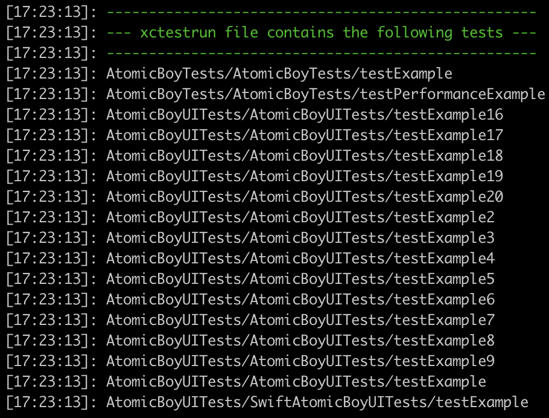

# ☑️  tests_from_xctestrun

Do you have multiple test targets referenced by your `xctestrun` file and need to know all the tests? Use this action to go through each test target, collect the tests, and return them to you in a simple and usable structure.

<center></center>

## Example

<!-- tests_from_xctestrun examples: begin -->

```ruby

require 'fastlane/actions/scan'

lane :split_tests do
  scan(
    build_for_testing: true,
    workspace: File.absolute_path('../AtomicBoy/AtomicBoy.xcworkspace'),
    scheme: 'AtomicBoy'
  )
  derived_data_path = Scan.config[:derived_data_path]
  xctestrun_file = Dir.glob("#{derived_data_path}/Build/Products/*.xctestrun").first
  tests = tests_from_xctestrun(xctestrun: xctestrun_file).values.flatten.shuffle
  slice_size = (tests.size/4.0).ceil
  tests.each_slice(slice_size).each_with_index do |inner_array, index|
    File.write("test_output/batch#{index}.txt", inner_array.join(','))
  end
end

lane :run_built_tests_with_matching_name do |options|
  batch_file = File.join('test_output', "batch#{options[:batch_index]}.txt")
  only_testing = File.read(batch_file).split(',')
  multi_scan(
    workspace: File.absolute_path('../AtomicBoy/AtomicBoy.xcworkspace'),
    scheme: 'AtomicBoy',
    try_count: 3,
    fail_build: false,
    only_testing: only_testing
  )
end

```
<!-- tests_from_xctestrun examples: end -->

## Parameters

<!-- tests_from_xctestrun parameters: begin -->
|Parameter|Description|Default Value|
|:-|:-|-:|
|xctestrun|The xctestrun file to use to find where the xctest bundle file is for test retrieval||
|invocation_based_tests|Set to true If your test suit have invocation based tests like Kiwi|false|
|swift_test_prefix|The prefix used to find test methods. In standard XCTests, this is `test`. If you are using Quick with Swift, set this to `spec`|test|
<!-- tests_from_xctestrun parameters: end -->
